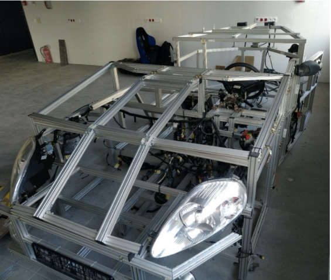

# GrandePunto Car Control System

## Overview
This project is a control system for a Fiat Grande Punto model, developed as
part of a master's thesis. The system enables students to conduct laboratory
exercises related to automotive communication networks. The project integrates a
modular control approach using CAN (Controller Area Network) and LIN (Local
Interconnect Network) protocols.

## Features
- **CAN Communication**: Implements CAN High-Speed and CAN Low-Speed
  communication.
- **LIN Support**: Controls auxiliary vehicle systems such as air conditioning
  and dashboard indicators.
- **ECU Simulation**: Emulates Electronic Control Units (ECUs) for vehicle
  component management.
- **Dashboard Control**: Interfaces with the instrument cluster for signal
  transmission.
- **Air Conditioning Module**: Controls HVAC system functions.
- **Steering Column Switches**: Interacts with steering wheel switches for
  signal processing.
- **Radio Integration**: Demonstrates connectivity between the infotainment
  system and control networks.
- **Hardware Expansion Support**: Compatible with STM32 microcontrollers for
  additional development.

## Architecture
The system is structured using the following components:

- **Microcontroller Unit (MCU)**: Based on STM32 Nucleo, featuring an ARM
  Cortex-M core.
- **CAN Interface**: Utilizes Vector Informatik tools (e.g., CANoe) for network
  communication.
- **LIN Interface**: Handles data exchange for comfort-related functionalities.
- **MATLAB & Simulink**: Used for simulation and validation of network
  interactions.
- **Vehicle Network Toolbox**: Assists in debugging and monitoring bus
  communication.

## Installation
1. **Hardware Setup**: Ensure an STM32 development board and a compatible
   CAN/LIN interface are available.
2. **Software Requirements**:
   - MATLAB with Vehicle Network Toolbox
   - CANoe (or BusMaster as an alternative open-source tool)
   - STM32CubeIDE for firmware development
3. **Running the System**:
   - Load the firmware onto the STM32 board.
   - Connect the CAN and LIN interfaces to the appropriate vehicle subsystems.
   - Use MATLAB or CANoe to send and monitor messages.

## Future Enhancements
- Integration with modern automotive Ethernet networks.
- Expansion of CAN FD support for higher data rates.
- Development of a GUI for easier interaction with network diagnostics.
